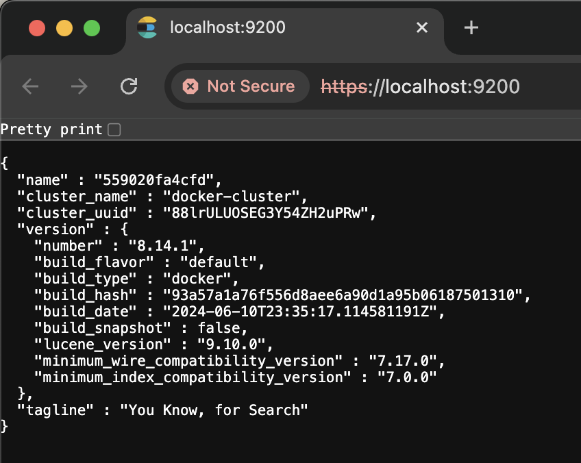

# Batch Data Pipeline¶

- Installing Softwares
- Scenario: Carpark system 

Generate, process and save the data every 5 mins for reporting.

Create a new jupyter notebook file "batch\_data\_pipeline.ipynb".

In [ ]:

```
# import libraries

from faker import Faker
import json
from datetime import datetime, timedelta
import random
import pandas as pd
import matplotlib.pyplot as plt

date_format = "%d/%m/%Y %H:%M:%S"
```

# 1. Installing Softwares¶

# 1.1 Install docker¶

1. Download and install docker from https://www.docker.com/

# 1.2 Install Airflow and postgresql¶

1. Open command line or terminal.
2. In your project folder, create a airflow folder.

    `$ mkdir dev_airflow` 
 `$ cd dev_airflow`
3. Download Apache Airflow's docker installation procedure.

    `curl -LfO 'https://airflow.apache.org/docs/apache-airflow/2.9.2/docker-compose.yaml' `
4. Edit docker-compose.yaml to add "ports: - "5432:5432"" for postgres.


5. Navigate into the airflow folder and create the folders for airflow.

    `$ mkdir -p ./dags ./logs ./plugins ./config`
6. Prepare the environment.

    `echo -e "AIRFLOW_UID=$(id -u) \nAIRFLOW_PROJ_DIR=/Users/personal_projects/projects/ee3801/dev_airflow" > .env`
7. Build the docker.

    `$ docker compose up airflow-init`
 `$ docker compose up`
8. Wait for dev\_airflow-airflow-webserver-1 to start up. You can stop the dev\_airflow in the terminal and start in docker dashboard.
9. In your browser, go to http://localhost:8080. Login user: airflow, password: airflow.
10. In the Docker Dashboard, you should be able to see the containers in dev\_airflow running. You can also see that postgresql is installed.


11. Next we want to configure the postgresql. In the terminal, access the docker "dev\_airflow-postgres-1" container and check the postgresql version.

    `docker exec -it dev_airflow-postgres-1 /bin/bash`
 `postgres -V`
12. Access postgresql in terminal, create database `carpark_system` and list database. Type `exit` and `exit` to exit postgresql console and container.

    `psql -U airflow`
 `CREATE DATABASE carpark_system;`
 `\l`


# 1.3 Install pgadmin4¶

1. Next install pgadmin4. In your browser, go to http://localhost:80.

    `docker pull dpage/pgadmin4`

    `docker run --name dev_pgadmin4 -p 80:80 -e 'PGADMIN_DEFAULT_EMAIL=<youremail>' -e 'PGADMIN_DEFAULT_PASSWORD=<yourpassword>' -d dpage/pgadmin4:latest`


2. Click on Add New Server and configure the server.

    Name: airflow-postgres-1 
 Host: host.docker.internal 
 Database: postgres 
 Username: airflow 
 Password: airflow


3. Create Table by right click on Database &gt; carpark\_system &gt; Schemas &gt; public &gt; Tables.

    General &gt; Name: CarPark Columns

    - Plate, text
    - LocationID, text
    - Entry\_DateTime, timestamp without time zone
    - Exit\_DateTime, timestamp without time zone
    - Parking\_Charges, numeric


# 1.4 Install elasticsearch and kibana¶

1. Open command line or terminal. Go to directory.

    `cd /Users/personal_projects/projects/ee3801/elasticsearch`
2. Create docker network.

    `docker network create elastic`
3. Run the command to get the docker image.

    `docker pull docker.elastic.co/elasticsearch/elasticsearch:8.14.1`
4. Run the docker container and name it dev\_es01.

    `docker run --name dev_es01 --net elastic -p 9200:9200 -it -m 1GB docker.elastic.co/elasticsearch/elasticsearch:8.14.1`
5. Take note of the password for elactic user, CA certificate and enrollment token for kibana generated. `Ctrl-C` at terminal and start the dev\_es01 service in docker dashboard.
6. In the browser, go to https://localhost:9200/. Proceed to localhost. Enter the elastic user password generated to test if elasticsearch is setup.


7. Download http\_ca\_crt and test the access using curl.

    `cd /Users/personal_projects/projects/ee3801/elasticsearch/`

    `docker cp dev_es01:/usr/share/elasticsearch/config/certs/http_ca.crt .`

    `curl --cacert http_ca.crt -u elastic:<elastic_password> https://localhost:9200`
8. Create a data directory for kibana.

    `cd /Users/personal_projects/projects/ee3801/kibana`
 `mkdir data`
9. Download docker image and run the docker container for kibana. `Ctrl-C` at terminal and start the dev\_kib01 service in docker dashboard.

    `docker run --name dev_kib01 --net elastic -v /Users/personal_projects/projects/ee3801/kibana/data:/usr/share/kibana/data -p 5601:5601 docker.elastic.co/kibana/kibana:8.14.1`


10. In the browser, go to `https://0.0.0.0:5601/?code=******`. Enter username elastic and its password.


# 2. Scenario: Carpark system (daily reporting)¶

The organisation has a carpark system to monitor Cars entering and exiting carparks. The data that you are capturing is car plate number, time of entry, time of exit and the carpark. The rate of parking is 60 cents per half an hour. There are multiple stakeholders across the organisation accessing the data on-demand every 5 minutes to check on the status of the earnings through the parking system. Your company does not subscribe to Microsoft Power Platform.

You are to prepare the data for the stakeholders to report carpark earnings on-demand every 5 minutes.

We move on to generate operations data, extract, process and load the data in local file sytem, relational database, NoSQL database and view the report through visualisations or dashboarding tools.

# 2.1 import libraries¶

In [ ]:

```
from faker import Faker
import json
from datetime import datetime, timedelta
import random
import pandas as pd
import matplotlib.pyplot as plt
import psycopg2 as db

import os
os.chdir('/Users/<username>/projects/ee3801')

date_format = "%d/%m/%Y %H:%M:%S"
```

# 2.2 Prepare data¶

Generate more simulated car entry and exit data and load into database

In [ ]:

```
# Read existing data 
carpark_system_df = pd.read_csv("data/carpark_system.csv", encoding="utf-8-sig")
carpark_system_df.drop(columns="Unnamed: 0", inplace=True)
carpark_system_df.head()

# generate exit data and charging on previous dataset
for index, item in carpark_system_df.iterrows():
    
    if str(item["Exit_DateTime"]) == "" or item["Exit_DateTime"]==None or str(item["Exit_DateTime"]) == "nan":
        days  = 0 # not more than a day
        hours = random.randint(0, 12) # not more than 12 hours
        minutes = random.randint(1, 60)
        seconds = random.randint(1, 60)

        exit_datetime = datetime.strptime(item['Entry_DateTime'], date_format) + timedelta(days=days, hours=hours, minutes=minutes, seconds=seconds)

        if exit_datetime==None or str(exit_datetime)=='nan':
            carpark_system_df.loc[index, "Exit_DateTime"] = datetime.strptime(item['Entry_DateTime'], date_format) + timedelta(hours=hours, minutes=minutes, seconds=seconds)
        else:
            carpark_system_df.loc[index, "Exit_DateTime"] = exit_datetime.strftime(date_format)

        charged = (exit_datetime - datetime.strptime(item['Entry_DateTime'], date_format)).seconds/60/60/2 * 60/100
        carpark_system_df.loc[index, "Parking_Charges"] = charged

# generate new cars entry and exit

fake=Faker()
fake.license_plate()

class CarPark:
    def __init__(self, Plate, LocationID, Entry_DateTime, Exit_DateTime, Parking_Charges):
        self.Plate = Plate
        self.LocationID = LocationID
        self.Entry_DateTime = Entry_DateTime
        self.Exit_DateTime = Exit_DateTime
        self.Parking_Charges = Parking_Charges

def createNewCarEntryNow():
    # days  = random.randint(1, 60) # 2-3 months
    hours = random.randint(9, 20)
    minutes = random.randint(1, 60)
    seconds = random.randint(1, 60)

    ts = datetime.now() - timedelta(hours=hours, minutes=minutes, seconds=seconds)

    hours = random.randint(0, 9) # not more than 12 hours
    minutes = random.randint(1, 60)
    seconds = random.randint(1, 60)

    duration = timedelta(hours=hours, minutes=minutes, seconds=seconds)
    exit_datetime = ts - duration
    charged = duration.seconds/60/60/2 * 60/100

    car = CarPark(
        Plate= fake.license_plate(),
        LocationID="Park"+str(random.randint(0, 5)),
        Entry_DateTime=ts.strftime(date_format), #.isoformat(),
        Exit_DateTime=exit_datetime.strftime(date_format),
        Parking_Charges=charged
    )

    return json.dumps(car.__dict__) #, sort_keys=True, indent=4)

# Generate more cars, append to list and save csv
carpark_system = []
for i in range(100):
    thiscar_dict = eval(createNewCarEntryNow())
    carpark_system.append(list(thiscar_dict.values()))

new_carpark_system_df = pd.DataFrame(carpark_system, columns=list(eval(createNewCarEntryNow()).keys()))
print("new_carpark_system_df:",len(new_carpark_system_df))
# print(new_carpark_system_df.head())

updated_carpark_system_df = pd.concat([carpark_system_df,new_carpark_system_df], axis=0)
print("updated_carpark_system_df:",len(updated_carpark_system_df))
updated_carpark_system_df.tail()

# export to csv for further analysis
updated_carpark_system_df.to_csv("data/carpark_system.csv", encoding='utf-8-sig')
# export to your OneDrive too for on-demand refresh
updated_carpark_system_df.to_csv("/Users/peihuacher/Library/CloudStorage/OneDrive-NationalUniversityofSingapore/Courses/CDE_EDIC/ee3801/lab/carpark_system.csv", encoding='utf-8-sig')
    
```

# 2.3 Insert, Select, Delete data in postgresql¶

In [ ]:

```
!mkdir ./dev_airflow/dags/data
!pwd
```

In [ ]:

```
import pandas as pd
df = pd.read_csv('./data/carpark_system.csv', encoding='utf-8-sig')
df.drop(columns="Unnamed: 0", inplace=True)
df['Entry_DateTime'] = pd.to_datetime(df['Entry_DateTime'],format=date_format)
df['Exit_DateTime'] = pd.to_datetime(df['Exit_DateTime'],format=date_format)
df.head()
```

In [ ]:

```
# Create database connection
conn_string="dbname='carpark_system' host='localhost' user='airflow' password='airflow'"
conn=db.connect(conn_string)
cur=conn.cursor()
```

In [ ]:

```
# Check data in table CarPark
query = 'SELECT count(*) FROM public."CarPark"'
cur.execute(query)

# iterate through all the records
for record in cur:
    print(record)

conn.commit()
```

In [ ]:

```
# insert one row into database
query = 'INSERT INTO public."CarPark"("Plate", "LocationID", "Entry_DateTime", "Exit_DateTime", "Parking_Charges") VALUES (%s, %s, %s, %s, %s)'
data=tuple(df.iloc[0])
cur.mogrify(query,data)
# execute the query
cur.execute(query,data)

# insert multiple records in a single statement
data = []
query = 'INSERT INTO public."CarPark"("Plate", "LocationID", "Entry_DateTime", "Exit_DateTime", "Parking_Charges") VALUES (%s, %s, %s, %s, %s)'
for index, item in df.iterrows():
    if index > 0:
        data.append(tuple(item))
data_for_db = tuple(data)
cur.mogrify(query,data_for_db[0])
# execute the query
cur.executemany(query,data_for_db)

# make it permanent by committing the transaction
conn.commit()
```

# 2.4 Generate car entry and exit every 5 minutes¶

1. Download the [generateCars_insertPostgresql.py](./generateCars_insertPostgresql.py) and [readPostgressql_writeElasticsearch.py](./readPostgressql_writeElasticsearch.py). Edit the passwords and place the file inside ~/dev\_airflow/dags/
2. In your browser, go to http://localhost:8080. Login user: airflow, password: airflow.
3. In the DAGS tab, search for carpark.


4. Activate the dags and set to 5 runs. You should see the 5 runs and tasks in dark green. Click on the graph and task then view the logs in the Logs.


5. If the readPostgressql\_writeElasticsearch.py dag is successful you should see the index in kibana http://localhost:5601/. Search for Index Management and you will see the index below.


6. In ariflow, remember to switch off the batch processes by deactivating the dags.


7. In kibana, search for Data View and create a Data View to explore your data.

    Name: carpark\_system Index pattern: fromposgresql\*


8. In kibana, search for Dashboard. Create your own dashboard to visualise and answer the questions below.

    - What is the top 5 average parking charges for each carpark location? Screen capture your dashboard output and submit in the notebook. i.e. ``


# 3. Setup UAT Airflow on docker in AWS EC2 Instance¶

# 3.1 Create EC2 Instance¶

1. Login to AWS and create an EC2 instance with the configurations below

    ```
    Server Name: ee3801part2 
    OS: Ubuntu Server 24.04 
    Architecture: 64-bit 
    instance type: t2.large # 2 vCPU 8 GiB Memory
    Key pair: <previously created>
    Network settings: Allow SSH traffic from Anywhere
    Allow HTTPS
    Allow HTTP
    Configure Storage
    1x30GiB gp3
    ```
2. Launch Instance
3. Click on the instance and click Connect. Go to SSH client. Copy the Example.
4. Open a terminal and ssh into server.

# 3.2 Install docker¶

1. This instructions is according to this website https://docs.docker.com/engine/install/ubuntu/#install-using-the-repository.

    ```
    # Add Docker's official GPG key:
    sudo apt-get update
    sudo apt-get install ca-certificates curl
    sudo install -m 0755 -d /etc/apt/keyrings
    sudo curl -fsSL https://download.docker.com/linux/ubuntu/gpg -o /etc/apt/keyrings/docker.asc
    sudo chmod a+r /etc/apt/keyrings/docker.asc
    
    # Add the repository to Apt sources:
    echo \
      "deb [arch=$(dpkg --print-architecture) signed-by=/etc/apt/keyrings/docker.asc] https://download.docker.com/linux/ubuntu \
      $(. /etc/os-release && echo "$VERSION_CODENAME") stable" | \
      sudo tee /etc/apt/sources.list.d/docker.list > /dev/null
    sudo apt-get update
    ```
2. Install docker

    `sudo apt-get install docker-ce docker-ce-cli containerd.io docker-buildx-plugin docker-compose-plugin`
3. To start docker without using root, we need to assign this user to the docker group.

    ```
    sudo usermod -aG docker $USER
    ```
4. Logout, login and try docker command.

    `docker —version`
5. You can install Airflow in this docker in EC2 instance with instructions in 1.2 but take note of

    - Name the folder as uat\_airflow
6. To access the server from browser, you will need to access EC2 &gt; Security Groups &gt; Edit inbound rules &gt; Add rule &gt; Save rules

    ```
    Type: Custom TCP
    Port Range: 8080
    Source: Anywhere-IPv4
    ```
7. Go to browser `public ip:8080`

In this lab we have created the development environment on local machine's docker and user acceptance test (uat) environment on EC2 instance's docker. This is to fully test the systems before pushing to a live production server. We will not cover production environment in this module.

# Conclusion¶

1. You have successfully created a data pipeline batch process to generate cars data and inserted data into a relational database (posgresql) every 5 minutes.
2. You have successfully created a data pipeline batch process to read from the relational database and inserted the data into a NoSQL database (elasticsearch) every 5 minutes.

**Questions to ponder**

1. When do you need to use batch process?
2. Give an example of an application that require batch processing?
3. What are the advantages of Airflow batch processing compared to Microsoft Power Apps (MS Excel, MS Sharepoint, MS Power BI)?
4. What are the disadvantages?
5. What level of data maturity in an organisation is more suitable for this application?

# Submissions next Wed 9pm (16 Oct 2024)¶

Submit your ipynb as a pdf. Save your ipynb as a html file, open in browser and print as a pdf. Include in your submission:

```
For Section 2.4 Point 8. Screen capture the dashboard to answer the question and place your dashboard screencapture in the same ipynb.

Answers the questions to ponder
```

~ The End ~