# Lab 8 Batch Data Pipeline

- Install required software
- Scenario: Carpark system \
  Generate, process, and save data every 5 minutes for reporting.

Create a new Jupyter notebook file named `batch_data_pipeline.ipynb`.

```python
# Import Libraries

from faker import Faker
import json
from datetime import datetime, timedelta, time
import random
import pandas as pd
import matplotlib.pyplot as plt

date_format = "%d/%m/%Y %H:%M:%S"
```

# 1. Installing software or importing software

Follow one of these options:

- Section 1.0: import all required software from an Amazon Machine Image (AMI) into your EC2 instance.
- <a href="./lab8 optional.md">Optional</a> Sections 1.1 to 1.4: install the software manually for Lab 8. You do not need to go through this section. It guides you through how to install the softwares in AWS EC2 instance.

Notes:
- Ensure EE3801 `Lab 1 Part A Part 1-4` and `Lab 7` is completed before proceeding with the steps below. 
- Ensure your AWS region is set to `ap-southeast-1`, and send your AWS account ID to the instructor for access.

# 1.0 Import Amazon Machine Images (AMIs) into your EC2 instance

1. In the AWS Console, go to EC2 > Launch Instance.

    Name and tags: `ee3801_part2_lab8`

    Application and OS Images (AMI): Select MyAMIs > Shared with me > `ee3801_part2_lab8_ami`

    Instance type: `t2.xlarge`

    Key pair: `MyKeyPair`

    Network settings: Create a security group with these rules:\
        - Allow SSH traffic from Anywhere: `0.0.0.0/0`\
        - Allow HTTPS traffic from the internet\
        - Allow HTTP traffic from the internet

    Configure storage: 1x `60` GiB `gp3`

    `Launch instance`

2. In the AWS Console, open EC2 > Instances > Security > Security groups url e.g. sg-xxxxxx > Edit inbound rules and add the following rules:

    - Type: SSH, Port range: 22, Source: Custom, `0.0.0.0/0`
    - Type: Custom TCP, Port range: 5601, Source: Custom, `0.0.0.0/0`
    - Type: Custom TCP, Port range: 8080, Source: Custom, `0.0.0.0/0`
    - Type: Custom TCP, Port range: 5432, Source: Custom, `0.0.0.0/0`
    - Type: Custom TCP, Port range: 29092, Source: Custom, `0.0.0.0/0`
    - Type: Custom TCP, Port range: 39092, Source: Custom, `0.0.0.0/0`
    - Type: Custom TCP, Port range: 49092, Source: Custom, `0.0.0.0/0`
    - Type: Custom TCP, Port range: 9200, Source: Custom, `0.0.0.0/0`
    - Type: HTTPS, Port range: 443, Source: Custom, My IP
    - Type: HTTPS, Port range: 80, Source: Custom, My IP

3. In the next steps, verify your installation and ensure you can access Apache Airflow, PostgreSQL, pgAdmin, Elasticsearch, and Kibana.

4. On the EC3 instance, start docker and verify your installation. 
    ```bash
    # start a terminal and navigate to project directory
    cd ~/Documents/projects/ee3801
    # ssh into EC2 instance
    ssh -i ~/MyKeyPair.pem ec2-user@<ip_address>
    # start docker service
    sudo service docker start
    # list all the containers
    docker ps -a

    ```

5. Verify if airflow is accessible. 
    - In a browser, open Airflow at http://<ip_address>:8080.

        Login user: airflow
        Password: *******

        Note: If you cannot access Airflow, verify the EC2 public IP address.

6. Verify if pgadmin4 is accessible. 
    - On the EC2 instance, start pgadmin4 docker container.
        ```bash
        docker start dev_pgadmin4
        ```

    - In a browser, go to http://<ip_address>.
    - Navigate to Carpark table that is already created for you.

    - Right click, choose `Properties` of database server and paste the correct <ip_address> of your EC2 instance (required whenever restart EC2 instance):

        - Name: `dev_airflow-postgres-1`
        - Host: `<ip_address>`
        - Database: `postgres`
        - Username: `airflow`
        - Password: `*******`

        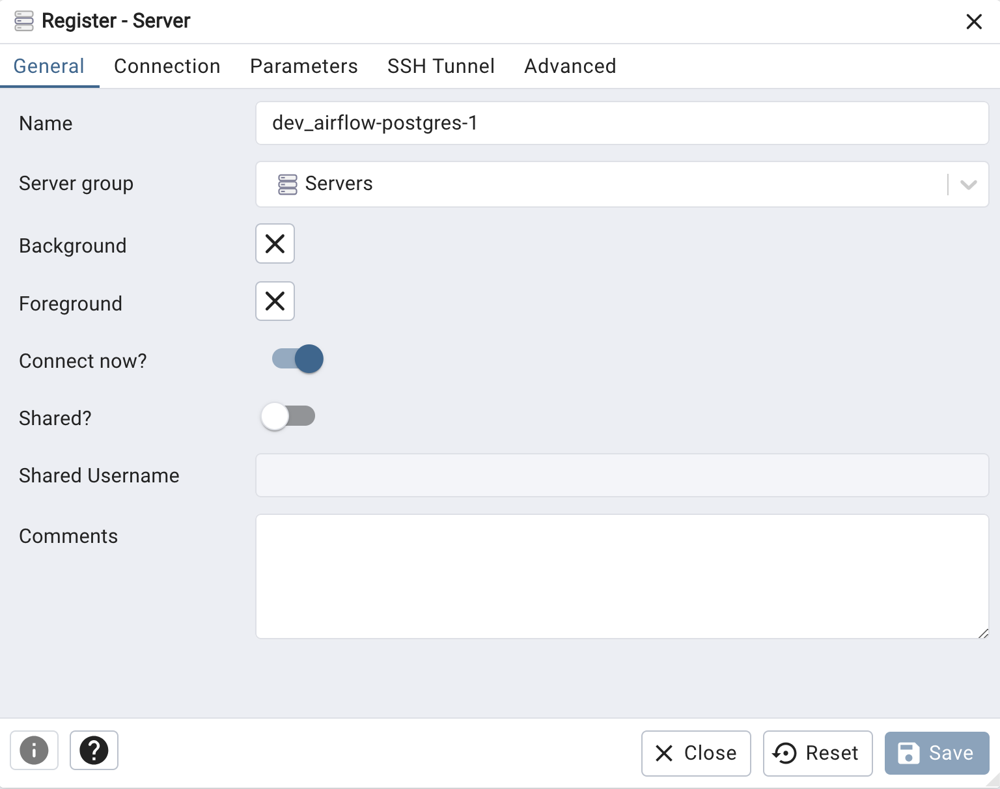
        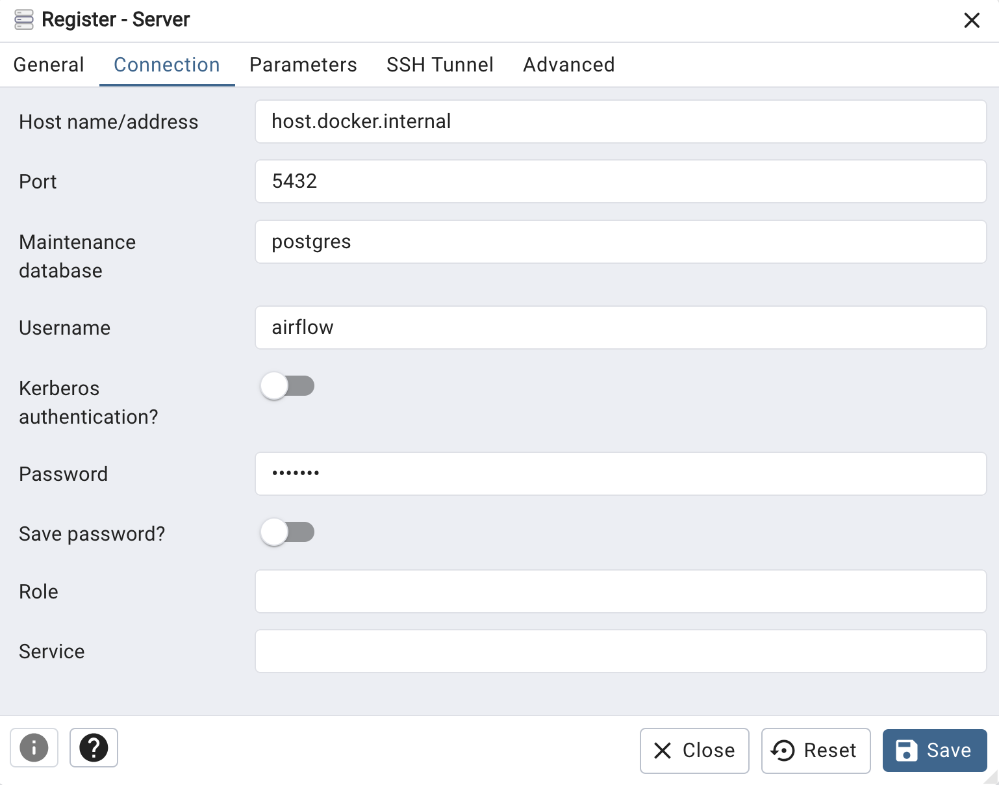

    - In pgAdmin, view the `CarPark` table.

        Database > carpark_system > Schemas > public > Tables > CarPark.

        - General > Name: `CarPark`
        - Columns:
            - Plate, text
            - LocationID, text
            - Entry_DateTime, timestamp without time zone
            - Exit_DateTime, timestamp without time zone
            - Parking_Charges, numeric

        Note: If the connection fails, verify the EC2 public IP address and port 80 and 443 MyIP is chosen.
    - Right click on CarPark > Script > Select and execute the script. The table has no records to begin with.

        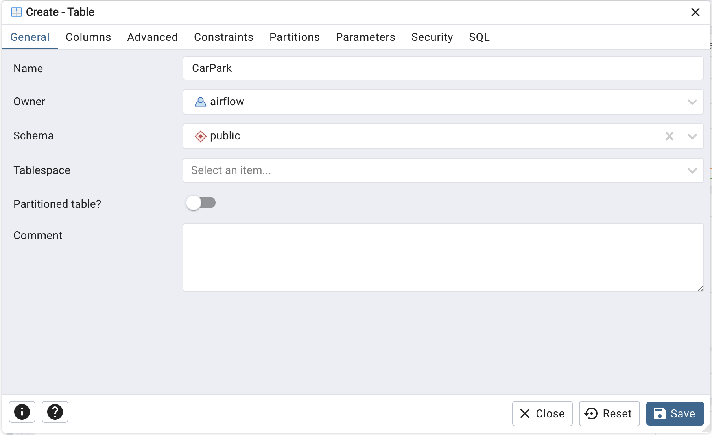
        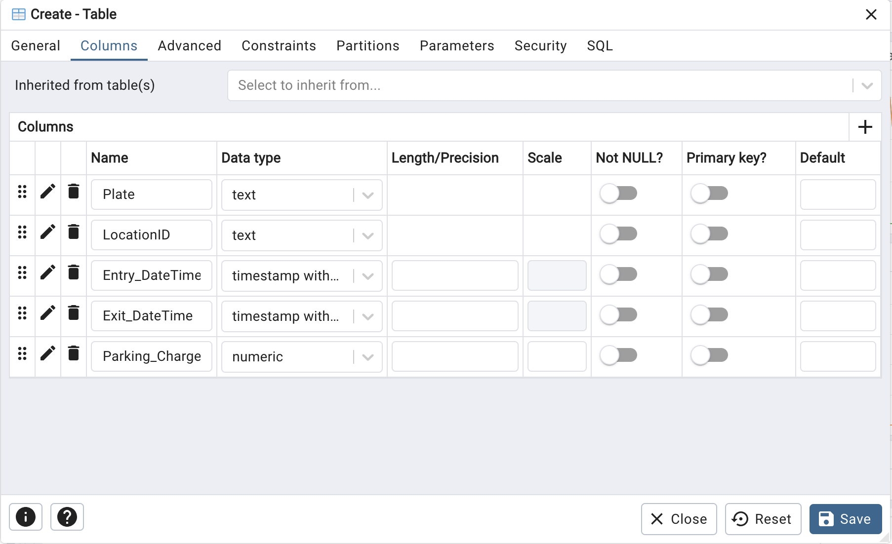
        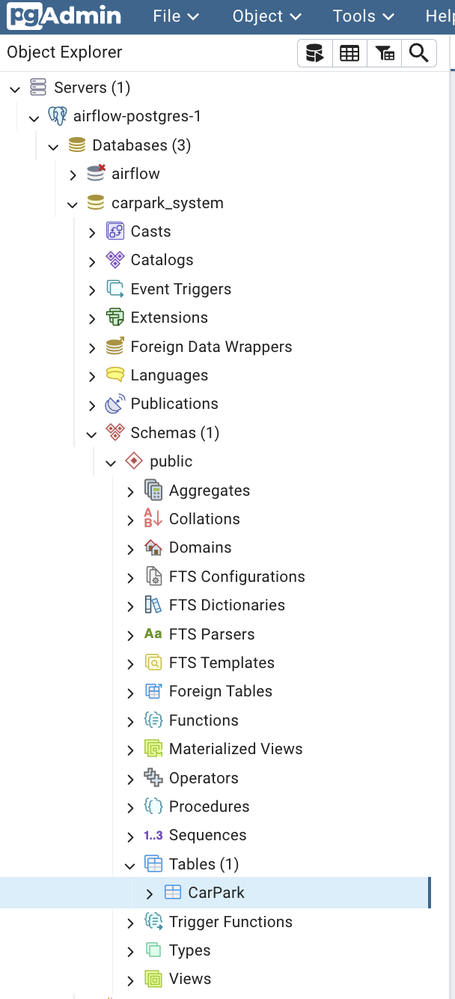

7. Verify if elasticsearch and kibana is accessible.

    - On the EC2 instance, start the Elasticsearch container `dev_es01`.
        ```bash
        # stop all containers
        docker stop $(docker ps -q)
        # start elasticsearch
        docker start dev_es01
        ```
    - On the EC2 instance, copy the CA certificate and test the connection using curl. Replace `<elastic_password>` with the password you copied in step 5.

        ```bash
        cd ~/elasticsearch
        # ensure http_ca.crt is in directort
        ls -l
        # test the connection
        curl --cacert http_ca.crt -u elastic:<elastic_password> https://localhost:9200
        ```

        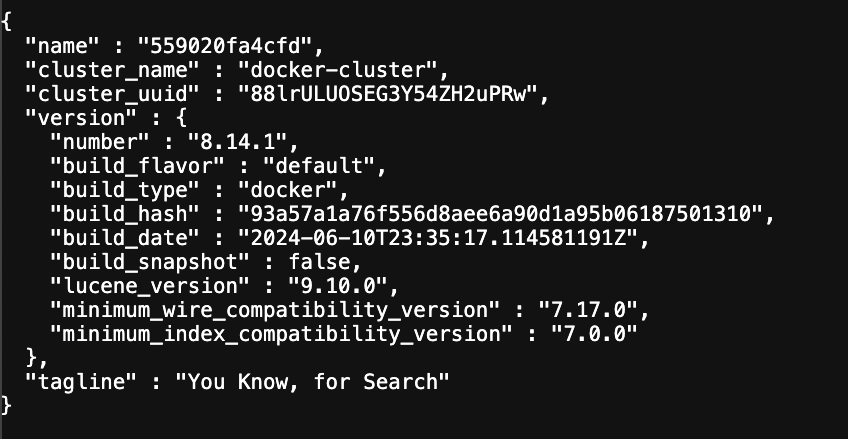

    - On the EC2 instance, run the Kibana container.

        ```bash
        docker start dev_kib01
        ```

    - In a browser, go to `http://<ip_address>:5601.

        Copy the emrollment token and paste it into Kibana in your browser.
        Log in with username `elastic` and the password you saved earlier.

        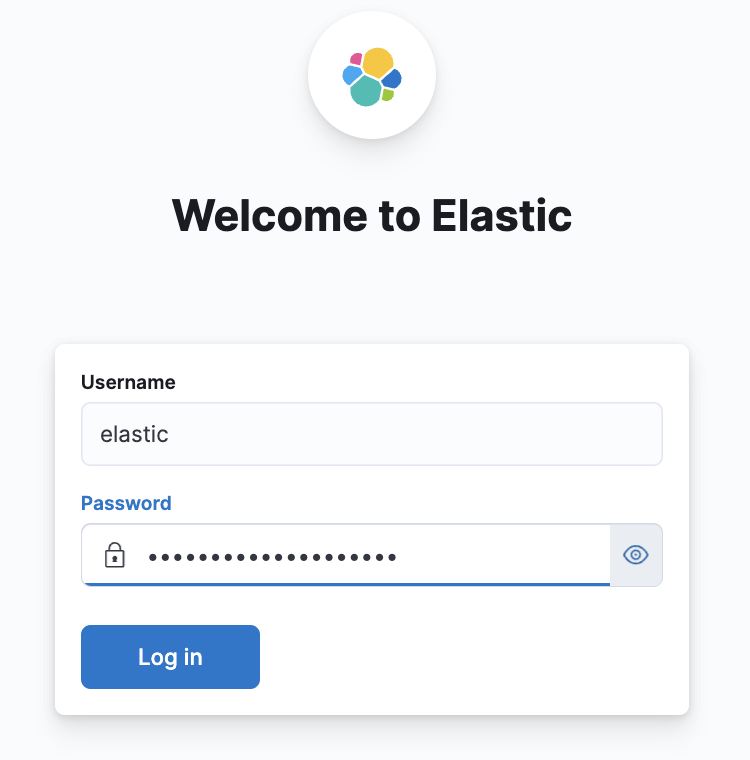
<br>

# 2. Scenario: Carpark system (daily reporting)

The organisation monitors cars entering and exiting carparks. The data captured includes the car plate number, entry time, exit time, and carpark location. Parking is charged at 60 cents per half hour. Multiple stakeholders access the data on-demand every 5 minutes to review earnings.

Your company does not use Microsoft Power Platform.

You must prepare the data so stakeholders can report carpark earnings every 5 minutes.

In this lab, you will generate operations data, then extract, transform, and load it into the local file system, a relational database, and a NoSQL database. Finally, you will view the data using visualization or dashboard tools.

Note: The instructions provided below should be executed in the file named `batch_data_pipeline.ipynb`. Use Visual Studio Code to write and execute the file. Please refer to lab 7 section 2 to setup your Visual Studio Code python environment, if you have not already done so.

# 2.1 Import libraries

On the local machine Visual Studio Code `batch_data_pipeline.ipynb`, install python packages for the lab. Copy and paste the codes into the cell and execute.

```python
# install python packages

# For MacOS users
# to upgrade pip
!python -m pip install --upgrade pip  
# to install package and dependencies         
!python -m pip install "psycopg[binary,pool]"  
!python -m pip install apache-airflow
```

```python
# For Windows users
# to upgrade pip
%python -m pip install --upgrade pip  
# to install package and dependencies         
%python -m pip install "psycopg[binary,pool]"  
%python -m pip install apache-airflow
```

On the local machine Visual Studio Code `batch_data_pipeline.ipynb`, import libraries, set working directory and date format. Copy and paste the codes into the cell and execute.

```python
from faker import Faker
import json
from datetime import datetime, timedelta, time
import random
import pandas as pd
import matplotlib.pyplot as plt
# import psycopg2 as db
import psycopg as db

import os
home_directory = os.path.expanduser("~")
os.chdir(home_directory+'/Documents/projects/ee3801')

date_format = "%d/%m/%Y %H:%M:%S"
```
<br>

# 2.2 Prepare data
On the local machine Visual Studio Code `batch_data_pipeline.ipynb`, generate more simulated car entry and exit data and load into database. Copy and paste the codes into the cell and execute.


```python
# Ensure you are in the correct working directory, `home_directory+'/Documents/projects/ee3801'`
# for MacOS users
!pwd
# for Windows users
%pwd
```


```python
# Read existing data 
carpark_system_df = pd.read_csv("./data/carpark_system.csv", encoding="utf-8-sig")
# carpark_system_df.drop(columns="Unnamed: 0", inplace=True)
carpark_system_df["Entry_DateTime"] = carpark_system_df["Entry_DateTime"].astype("string")
carpark_system_df["Exit_DateTime"] = carpark_system_df["Exit_DateTime"].astype("string")
carpark_system_df.head()

def generate_random_datetime_before_8pm(start_dt: datetime) -> datetime:
    """
    Generates a random datetime on the same day as start_dt, but not beyond 8 PM.
    If start_dt is already after 8 PM, the random datetime will be on the next day.
    """
    max_time_of_day = time(20, 0, 0) # 8 PM
    max_dt_for_day = datetime.combine(start_dt.date(), max_time_of_day)

    # Adjust start_dt if it's already past 8 PM
    if start_dt > max_dt_for_day:
        start_dt = datetime.combine(start_dt.date() + timedelta(days=1), time(0, 0, 0))
        max_dt_for_day = datetime.combine(start_dt.date(), max_time_of_day)

    time_diff_seconds = int((max_dt_for_day - start_dt).total_seconds())

    if time_diff_seconds <= 0:
        # This case happens if start_dt is exactly 8 PM or later on the same day,
        # and has been adjusted to the next day's midnight.
        # In this scenario, the random time will be between midnight and 8 PM of the next day.
        # Or if the adjusted start_dt is already after the max_dt_for_day on the next day,
        # which shouldn't happen with the current logic.
        return start_dt # Or handle as an error/specific case if no valid time exists

    random_seconds = random.randint(0, time_diff_seconds)
    return start_dt + timedelta(seconds=random_seconds)

# generate exit data and charging on previous dataset

for index, item in carpark_system_df.iterrows():
    if pd.isna(item["Exit_DateTime"]) or str(item["Exit_DateTime"]).strip() == "":
        if pd.isna(item["Entry_DateTime"]) or str(item["Entry_DateTime"]).strip() == "":
            continue
        exit_datetime = generate_random_datetime_before_8pm(datetime.strptime(item['Entry_DateTime'], date_format))
        # print(f"Entry: {item['Entry_DateTime']} | Exit: {exit_datetime.strftime(date_format)}")
        carpark_system_df.loc[index, "Exit_DateTime"] = exit_datetime.strftime(date_format)

        charged = (exit_datetime - datetime.strptime(item['Entry_DateTime'], date_format)).seconds / 3600 * 0.5
        carpark_system_df.loc[index, "Parking_Charges"] = charged


# generate new cars entry and exit

fake = Faker()

# define the CarPark class
class CarPark:
    def __init__(self, Plate, LocationID, Entry_DateTime, Exit_DateTime, Parking_Charges):
        self.Plate = Plate
        self.LocationID = LocationID
        self.Entry_DateTime = Entry_DateTime
        self.Exit_DateTime = Exit_DateTime
        self.Parking_Charges = Parking_Charges

def generate_past_datetime_hours(now: datetime, hours: int) -> datetime:

    # Define the time range for the past 1 minutes
    end_date = now
    start_date = now - timedelta(hours=hours) 

    time_delta_total_seconds = int((end_date - start_date).total_seconds())

    # Generate a random number of seconds within the hour range
    random_seconds_past = random.randint(0, time_delta_total_seconds)
    random_date_base = start_date + timedelta(seconds=random_seconds_past)

    # Generate random time components between 9 AM and 8 PM
    random_hour = random.randint(9, 20)  # 9 to 20 (inclusive for 8 PM)
    random_minute = random.randint(0, 59)
    random_second = random.randint(0, 59)

    # Combine date and time components
    generated_datetime = random_date_base.replace(
        hour=random_hour,
        minute=random_minute,
        second=random_second,
        microsecond=0  # Set microseconds to 0 for minute/second precision
    )

    return generated_datetime

# generate cars entering the carpark for the past 12 hours between 9 am to 8 pm for every minute and second
def createCarEntry():
    now = datetime.now()
    entry_time = generate_past_datetime_hours(now, 12) # Approximately 12 hours ago
    duration = entry_time - now
    charged = duration.seconds/60/60/2 * 60/100
    car = CarPark(
        Plate= fake.license_plate(),
        LocationID="Park"+str(random.randint(0, 5)),
        Entry_DateTime=entry_time.strftime(date_format),
        Exit_DateTime=now.strftime(date_format),
        Parking_Charges=charged
    )

    # return a json format
    return json.dumps(car.__dict__) 

# Generate more cars, append to list and save csv
carpark_system = []
for i in range(100):
    thiscar_dict = json.loads(createCarEntry())
    carpark_system.append(list(thiscar_dict.values()))

new_carpark_system_df = pd.DataFrame(carpark_system, columns=list(json.loads(createCarEntry()).keys()))
print("new_carpark_system_df:", len(new_carpark_system_df))
# print(new_carpark_system_df.head())
updated_carpark_system_df = pd.concat([carpark_system_df, new_carpark_system_df], axis=0)
updated_carpark_system_df.to_csv('./data/carpark_system.csv', encoding="utf-8-sig", index=False)
    

```


```python
# Inspect the first few lines of data in DataFrame
updated_carpark_system_df
```
<br>

# 2.3 Insert, Select, and Delete data in PostgreSQL
On the local machine Visual Studio Code `batch_data_pipeline.ipynb`, create data diretory in airflow dags folder and insert the data into relational database PostgreSQL. Copy and paste the codes into the cell and execute. 

```python
# For MacOS users
# create data directory in airflow dags folder
!mkdir -p ./dev_airflow/dags/data
# check you are in the correct working directory
!pwd
```

```python
# For Windows users
# create data directory in airflow dags folder
%mkdir ./dev_airflow/dags/data
# check you are in the correct working directory
%pwd
```


```python
import pandas as pd
df = pd.read_csv('./data/carpark_system.csv', encoding='utf-8-sig')
# df.drop(columns="Unnamed: 0", inplace=True)
df['Entry_DateTime'] = pd.to_datetime(df['Entry_DateTime'],format=date_format)
df['Exit_DateTime'] = pd.to_datetime(df['Exit_DateTime'],format=date_format)
df.head()
```


```python
len(df)
```


```python
# Create database connection
# replace the <ip_address> with your instance public ip address
conn_string="host=<ip_address> port=5432 dbname=carpark_system user=airflow password=********"
conn=db.connect(conn_string)
cur=conn.cursor()
```


```python
# Check data in table CarPark
query = 'SELECT count(*) FROM public."CarPark"'
cur.execute(query)

# iterate through all the records
for record in cur:
    print(record)

conn.commit()

```


```python
import numpy as np

# insert one row into database
query = 'INSERT INTO public."CarPark"("Plate", "LocationID", "Entry_DateTime", "Exit_DateTime", "Parking_Charges") VALUES (%s, %s, %s, %s, %s)'
data=tuple(df.iloc[0])
print(data)
# execute the query
cur.execute(query,data)


# insert multiple records in a single statement (excluding row 1 that was inserted above)
data = []
query = 'INSERT INTO public."CarPark"("Plate", "LocationID", "Entry_DateTime", "Exit_DateTime", "Parking_Charges") VALUES (%s, %s, %s, %s, %s)'
for index, item in df.iterrows():
    if index > 0:
        data.append(tuple(item))
data_for_db = tuple(data)
# execute the query
cur.executemany(query,data_for_db)

# make it permanent by committing the transaction
conn.commit()

```
```python
# Check data in table CarPark
query = 'SELECT count(*) FROM public."CarPark"'
cur.execute(query)

# iterate through all the records
for record in cur:
    print(record)

conn.commit()
```
<br>


# 2.4 Generate car entry and exit every 5 minutes

1. On the local machine, download the <a href="./generateCars_insertPostgresql.py">generateCars_insertPostgresql.py</a> and <a href="./readPostgressql_writeElasticsearch.py">readPostgressql_writeElasticsearch.py</a>. 

    - On the local machine, copy the two python files into directory `./dev_airflow/dags`
        ```bash
        cp ~/Downloads/*.py ~/Documents/projects/ee3801/dev_airflow/dags
        ```

    - On the local machine Visual Studio Code, edit the <ec2_ip_address>, airflow password, elasticsearch password and save the file.
    
    - On the local machine, copy the files to EC2 instance ~/dev_airflow/dags/ using the command:

        ```bash
        scp -i ~/MyKeyPair.pem ~/Documents/projects/ee3801/dev_airflow/dags/*.py ec2-user@<ip_address>:~/dev_airflow/dags/
        ```

    - On the EC2 instance terminal, start docker, start airflow and elasticsearch containers.
        ```bash
        ssh -i ~/MyKeyPair.pem ec2-user@<ip_address>
        # start docker service
        sudo service docker start
        # check started containers
        docker ps -a
        # start ariflow
        docker start $(docker ps -q -f "name=airflow")
        # start elasticsearch
        docker start dev_es01
        ```

2. On the browser in airflow, go to <a href="http://<ip_address>:8080">http://<ip_address>:8080</a>. Login user: airflow, password: *******.

3. On the browser in airflow, in the DAGS tab search for carpark.
    - Activate the `carpark_system_readfrompostgresql_toelasticsearch_DBdag` dag and trigger to run every 5 minutes.
    - Activate the `carpark_system_generate_cars_DBdag` dag to generate cars every 5 minutes.

        
        
        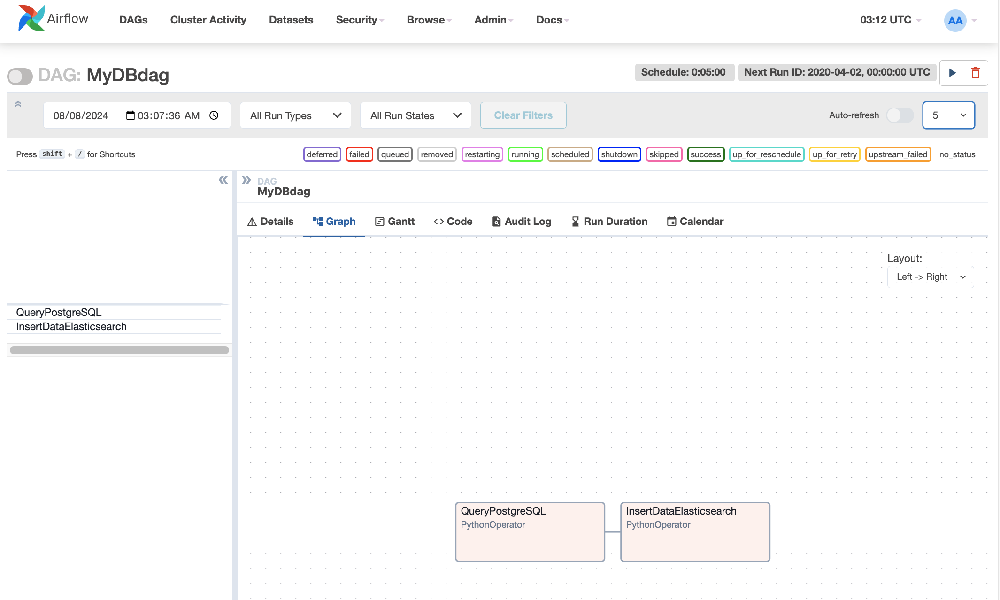

        

4. On the browser in airflow, select `Options` dropdown box and set `Number of Dag Runs` to 5 runs. Activate the Dag, click on the icon next to the dags' name. You should see the 5 runs and tasks in dark green. Click on the graph and task then view the logs in the Logs.

    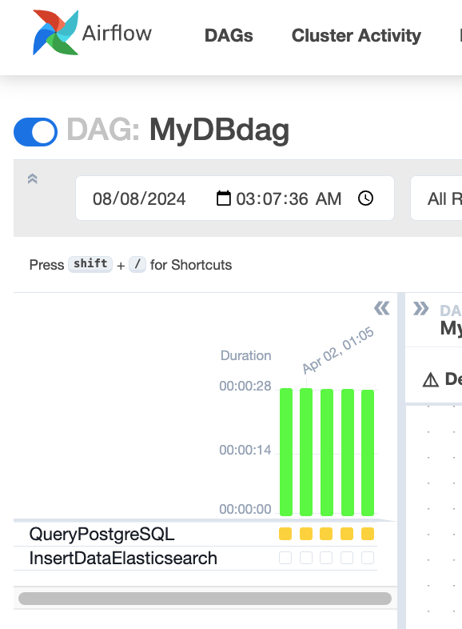

5. If the readPostgressql_writeElasticsearch.py and generateCars_insertPostgresql.py dag is successful you should see the index in kibana <a href="http://<ip_address>:5601/">http://localhost:5601/</a>. On the browser in kibana, search for Index Management and you will see the index below. 

    ```bash
    # On EC2 instance terminal, ensure kibana is started
    docker start dev_kib01
    ```
    
    - If InsertDataElasticSearch failed, ensure elasticsearch and kibana is started. If elasticsearch keeps restarting, 
        ```bash
        sudo sysctl -w vm.max_map_count=262144
        ``` 
        or 
        permanently set in server 
        ```bash
        vi /etc/sysctl.conf
        vm.max_map_count=262144
        ``` 

    - If it is still not showing, ensure elasticsearch is up and running.

        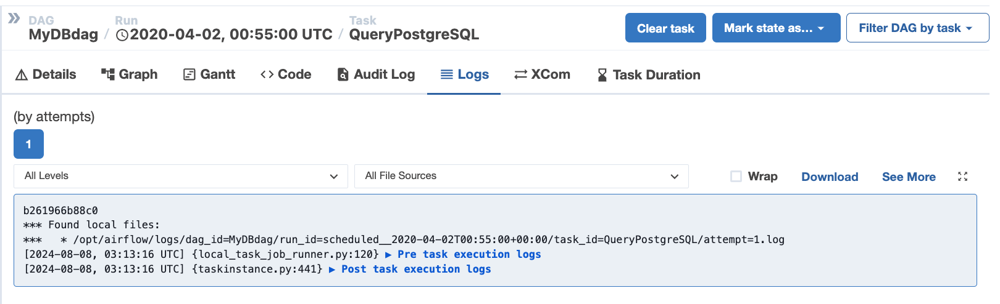

6. In the browser accessing ariflow, remember to turn off the batch processes by deactivating the dags.

    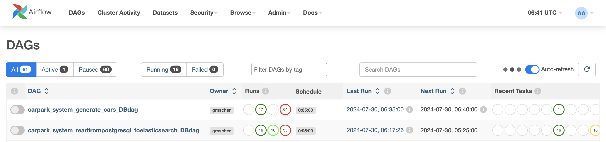

7. In the browser accessing kibana http://<ip_address>:5601, search for `Data View` and create a `Data View` to explore your data. Query your data with ES|QL

    Name: carpark_system\
    Index pattern: frompostgresql*

    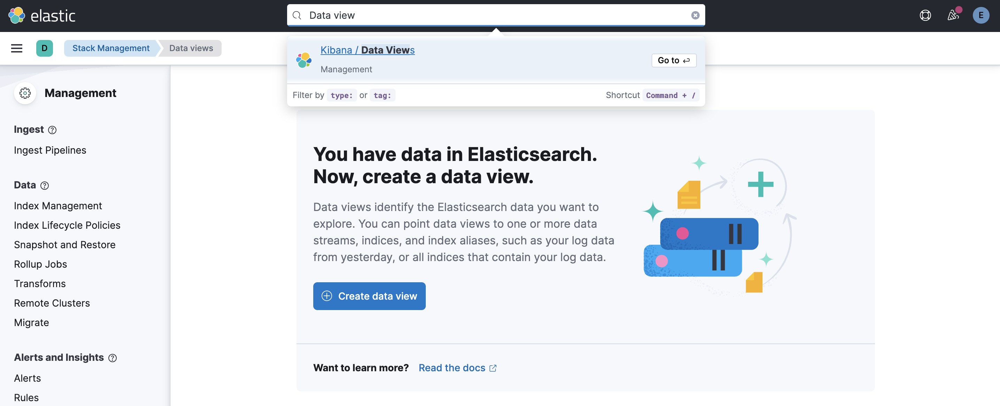
    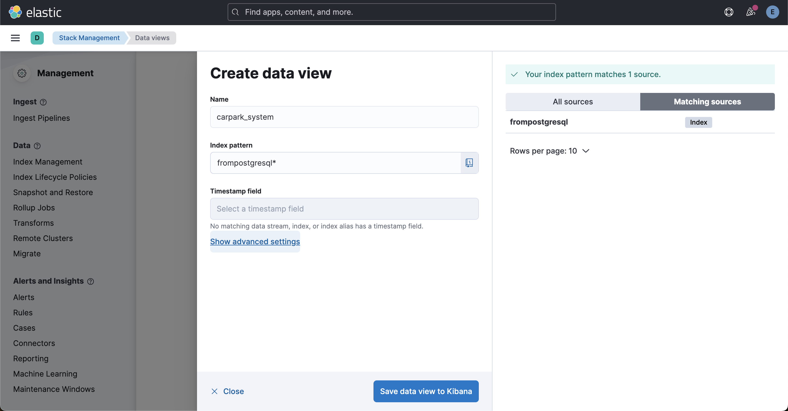
    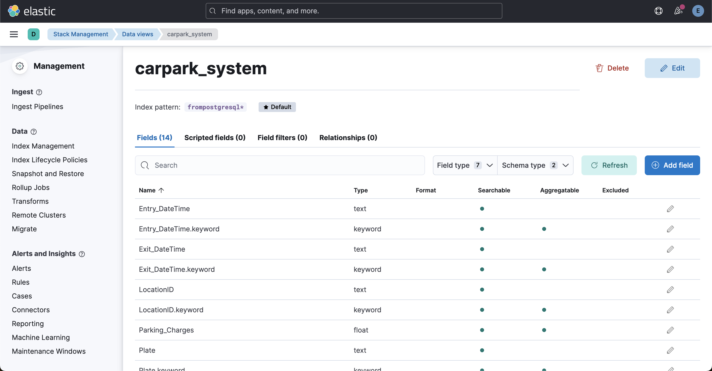
    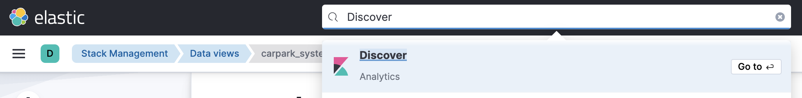
    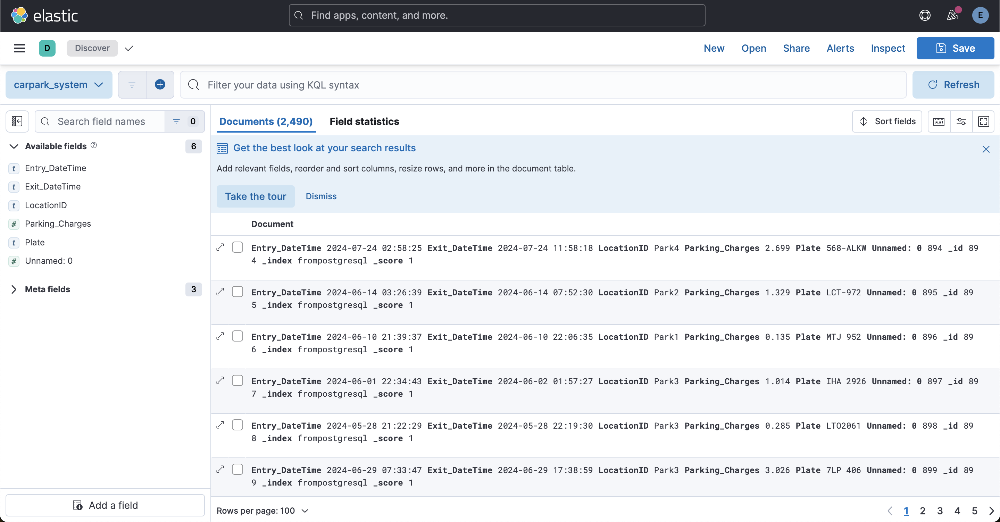
    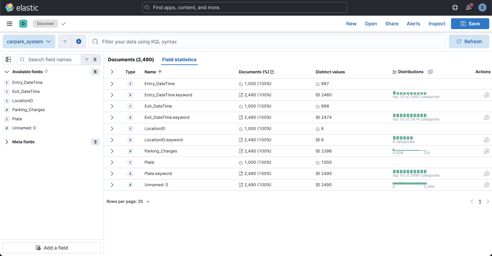
    

8. In the browser accessing kibana, search for Dashboard. Create your own dashboard to visualise and answer the questions below.

    - What is the average parking charges for each carpark location? \
    Screen capture your dashboard output and submit in the notebook. i.e. ``````

    <!--  -->
    <!--  -->


# Conclusion

In this lab, you created the development environment on an AWS EC2 instance using Docker. This setup lets you test the system before moving to a User Acceptance Testing (UAT) environment or production. UAT and production environments are not covered in this course.

1. You successfully created a batch data pipeline that generates carpark data and inserts it into a relational database (PostgreSQL).
2. You successfully created a batch data pipeline that reads from the relational database and inserts the data into a NoSQL database (Elasticsearch).

**Questions to ponder**

1. When do you need to use batch processing?
2. Give an example of an application that requires batch processing.
3. What are the advantages of Airflow batch processing compared to Microsoft Power Apps (Excel, SharePoint, Power BI)?
4. What are the disadvantages?
5. What level of data maturity in an organization is most suitable for this application?
<br>

# Submissions next Wed 9pm (15 Oct)

Submit your notebook as a PDF. Save your notebook as HTML, open it in a browser, and print it to PDF. Include in your submission:

- A screen capture of the dashboard for Section 2.4 Step 8.
- Answers to the questions to ponder.

~ The End ~
