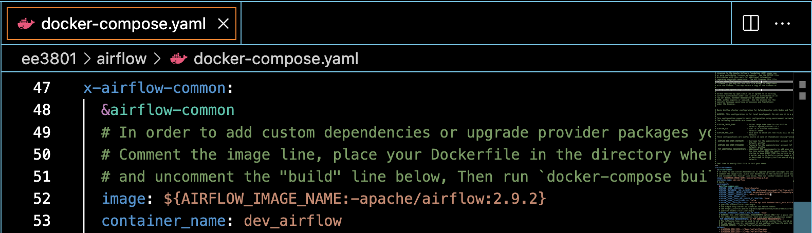
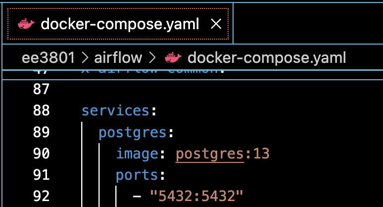
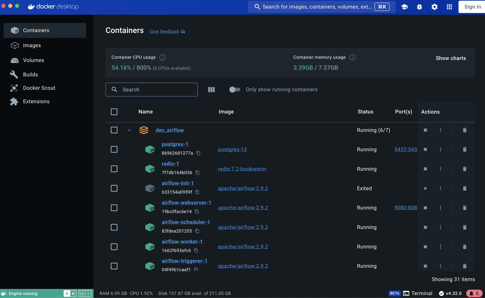
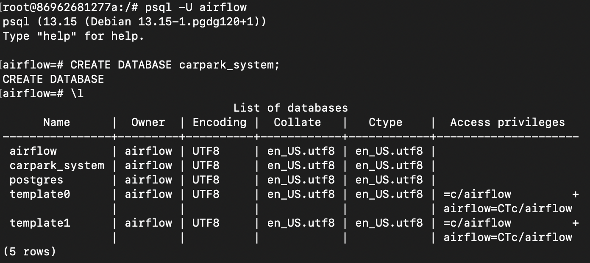
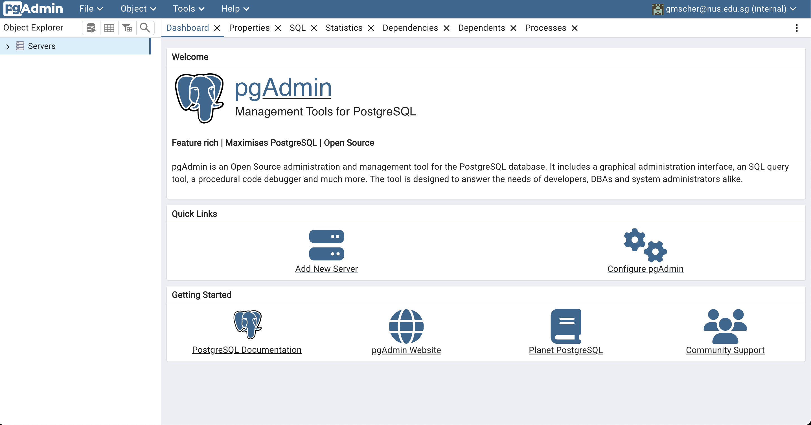
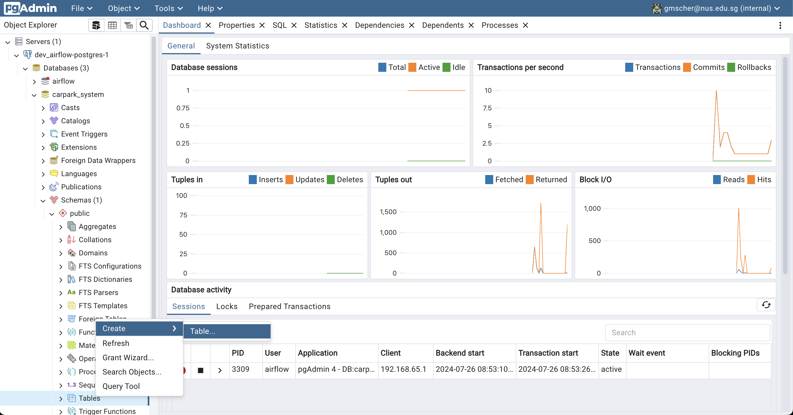
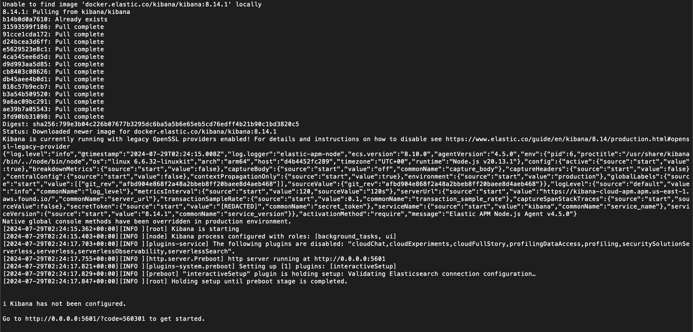
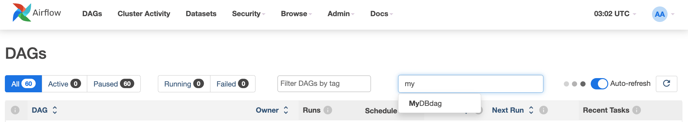

# Lab 8 Optional

- Install required softwares manually in AWS EC2 instance

# 1.1 Install Docker and configure AWS EC2 (optional)

1. On your local machine, create an AWS EC2 instance with 60 GiB storage and 16 GB RAM.

    ```bash
    aws ec2 run-instances --image-id resolve:ssm:/aws/service/ami-amazon-linux-latest/amzn2-ami-hvm-x86_64-gp2 --instance-type t2.xlarge --key-name MyKeyPair --block-device-mappings '[{"DeviceName":"/dev/xvda","Ebs":{"VolumeSize":60,"VolumeType":"gp3"}}]' --tag-specifications 'ResourceType=instance,Tags=[{Key=Name,Value=ee3801_part2_lab8_test}]'
    ```

    If you receive the error `You must specify a region`, run `aws configure` or add `--region ap-southeast-1`.

2. In the AWS Console, open EC2 > Instances > Security > Security groups url e.g. sg-xxxxxx > Edit inbound rules and add the rules shown in section 1.0, step 2.

3. On your local machine, change to your project directory.

    ```bash
    cd ~/Documents/projects/ee3801
    ```

4. SSH into the EC2 instance. Replace `<ip_address>` with the instance public IP.

    ```bash
    ssh -i "MyKeyPair.pem" ec2-user@<ip_address>
    ```

5. On the EC2 instance, update packages.

    ```bash
    sudo yum update -y
    ```

6. On the EC2 instance, install Docker.

    ```bash
    sudo amazon-linux-extras install docker
    ```

7. On the EC2 instance, start the Docker service.

    ```bash
    sudo service docker start
    ```

8. On the EC2 instance, add the current user (for example, `ec2-user`) to the `docker` group so Docker commands can run without `sudo`.

    ```bash
    sudo usermod -a -G docker ec2-user
    ```

9. Log out and log back in, or restart the SSH session, for the group changes to take effect.

10. On the EC2 instance, verify Docker is installed and running.

    ```bash
    sudo service docker start
    docker ps -a
    ```

11. On the EC2 instance, download Docker Compose.

    ```bash
    sudo curl -L "https://github.com/docker/compose/releases/download/v2.27.0/docker-compose-$(uname -s)-$(uname -m)" -o /usr/local/bin/docker-compose
    ```

12. On the EC2 instance, make Docker Compose executable.

    ```bash
    sudo chmod +x /usr/local/bin/docker-compose
    ```

13. On the EC2 instance, verify the installation.

    ```bash
    docker-compose --version
    ```

# 1.2 Install Airflow and PostgreSQL (optional)

1. On your local machine, open a terminal and SSH into the EC2 instance.

    ```bash
    cd ~/Documents/projects/ee3801

    ssh -i "MyKeyPair.pem" ec2-user@<ip_address>
    ```

2. On the EC2 instance, create an Airflow folder and change into it.

    ```bash
    mkdir dev_airflow

    cd dev_airflow
    ```

3. On the EC2 instance, download the Apache Airflow Docker Compose file.

    ```bash
    curl -LfO 'https://airflow.apache.org/docs/apache-airflow/stable/docker-compose.yaml'
    ```

4. On the EC2 instance, edit `docker-compose.yaml` to expose PostgreSQL by adding `ports: - "5432:5432"` under the PostgreSQL service.

    
    

5. On the EC2 instance, create the required Airflow folders.

    ```bash
    mkdir -p ./dags ./logs ./plugins ./config
    ```

6. On the EC2 instance, create the environment file.

    ```bash
    echo -e "AIRFLOW_UID=$(id -u) \nAIRFLOW_PROJ_DIR=~/dev_airflow" > .env

    more .env
    ```

7. On the EC2 instance, initialize and start Airflow.

    ```bash
    docker-compose up airflow-init

    docker-compose up
    ```

8. On the EC2 instance, press `Ctrl+C` to stop the foreground process, then log out and log back in or restart the SSH session and restart docker.

    ```bash
    sudo systemctl restart docker
    ```

    Note: Wait until `dev_airflow-airflow-apiserver-1` is healthy.

9. In a browser, open Airflow at <a href="http://<ip_address>:8080">http://<ip_address>:8080</a>.

    Login user: `airflow`\
    Password: `*******`

    Note: If you cannot access Airflow, verify the EC2 public IP address.

10. On the EC2 instance, verify Docker containers are running.

    ```bash
    docker ps -a
    ```

    You should see the Airflow containers and PostgreSQL.

    

11. On the EC2 instance, create data directory in dev_airflow-airflow-scheduler-1, access the PostgreSQL container and check the version.

    ```bash
    docker exec -it dev_airflow-airflow-scheduler-1 /bin/bash
    mkdir -p /opt/airflow/dags/data/
    exit

    docker exec -it dev_airflow-postgres-1 /bin/bash
    
    postgres -V
    ```

    

12. On the EC2 instance, create the `carpark_system` database.

    ```bash
    psql -U airflow

    CREATE DATABASE carpark_system;

    \l

    exit
    exit
    ```

    

# 1.3 Install pgAdmin 4 (optional)

1. On the EC2 instance, install pgAdmin 4 with Docker. Use your own email and password.

    ```bash
    cd ..
    
    docker pull dpage/pgadmin4

    docker run --name dev_pgadmin4 -p 80:80 -e 'PGADMIN_DEFAULT_EMAIL=<youremail>' -e 'PGADMIN_DEFAULT_PASSWORD=<yourpassword>' -d dpage/pgadmin4:latest
    ```

    

2. On your local machine, check if you have port 80 already used by any system. If port 80 is occupied, shutdown the service (on your local machine) before accessing the pgAdmin4 (on EC2 instance) through the local browser.

    ```bash
    # On macOS or linux
    sudo lsof -i tcp:80

    # On Windows
    netstat -ano | findstr :80
    ```

2. In a browser, go to <a href="http://<ip_address>">http://<ip_address></a>.

    Click Add New Server and configure the connection:

    - Name: `dev_airflow-postgres-1`
    - Host: `<ip_address>`
    - Database: `postgres`
    - Username: `airflow`
    - Password: `*******`

    
    

3. In pgAdmin, create the `CarPark` table.

    Database > carpark_system > Schemas > public > Tables > Create a new table.

    - General > Name: `CarPark`
    - Columns:
        - Plate, text
        - LocationID, text
        - Entry_DateTime, timestamp without time zone
        - Exit_DateTime, timestamp without time zone
        - Parking_Charges, numeric

    Note: If the connection fails, verify the EC2 public IP address and port 80 and 443 MyIP is chosen.

    
    
    
    

# 1.4 Install Elasticsearch and Kibana (optional)

1. On the EC2 instance, create the `elasticsearch` directory and change into it.

    ```bash
    docker stop $(docker ps -q)

    mkdir ~/elasticsearch
    
    cd ~/elasticsearch
    ```

2. On the EC2 instance, create a Docker network. This creates a new, isolated virtual network on your EC2 instance named elastic. By default, Docker containers cannot easily talk to each other using their container names. Creating a custom network solves this problem. We create this to let elasticsearch and kibana communicate securely.

    ```bash
    docker network create elastic
    ```

3. On the EC2 instance, pull the Elasticsearch Docker image.

    ```bash
    docker pull docker.elastic.co/elasticsearch/elasticsearch:9.0.4
    ```

4. On the EC2 instance, run the Elasticsearch container and name it `dev_es01`.

    ```bash
    echo "vm.max_map_count=262144" | sudo tee -a /etc/sysctl.conf
    
    sudo systemctl restart docker
    
    sudo sysctl -w vm.max_map_count=262144
    # stop all other services fist
    docker stop $(docker ps -q)
    # start elasticsearch 
    docker run --name dev_es01 --net elastic -p 9200:9200 -it -m 1GB docker.elastic.co/elasticsearch/elasticsearch:9.0.4
    ```

5. Note the password for the `elastic` user, the CA certificate, and the Kibana enrollment token.

6. Stop the container with `Ctrl+C`, then start `dev_es01` again.

    ```bash
    docker start dev_es01
    ```

7. On the EC2 instance, copy the CA certificate and test the connection using curl. Replace `<elastic_password>` with the password you copied in step 5.

    ```bash
    cd ~/elasticsearch

    docker cp dev_es01:/usr/share/elasticsearch/config/certs/http_ca.crt .
    # test the connection
    curl --cacert http_ca.crt -u elastic:<elastic_password> https://localhost:9200
    ```

    

8. On the EC2 instance, create a directory for Kibana data.

    ```bash
    mkdir -p ~/kibana/data
    cd ~/kibana
    ```

9. On the EC2 instance, run the Kibana container.

    ```bash
    docker run --name dev_kib01 --net elastic -v ~/kibana/data:/usr/share/kibana/data -p 5601:5601 docker.elastic.co/kibana/kibana:9.0.4
    ```

    
    

10. In a browser, go to `http://<ip_address>:5601/?code=xxxxxx`.

    Copy the emrollment token and paste it into Kibana in your browser.
    Log in with username `elastic` and the password you saved earlier.

    